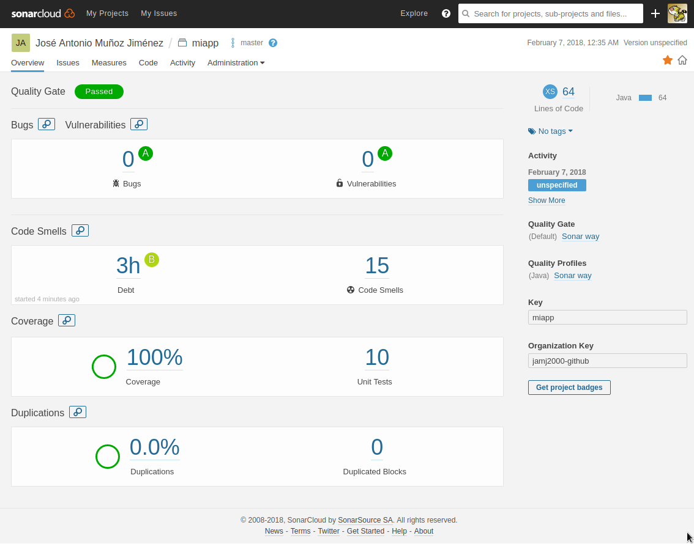
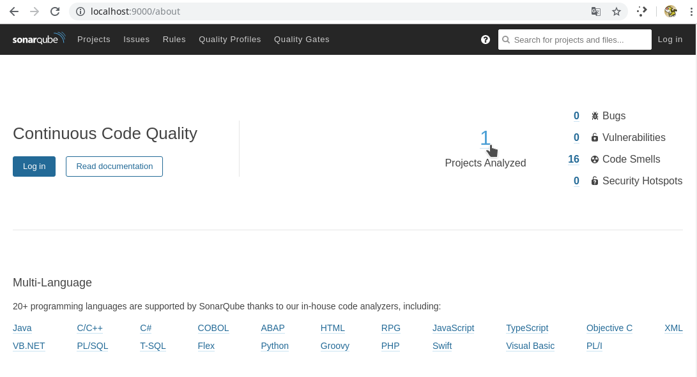
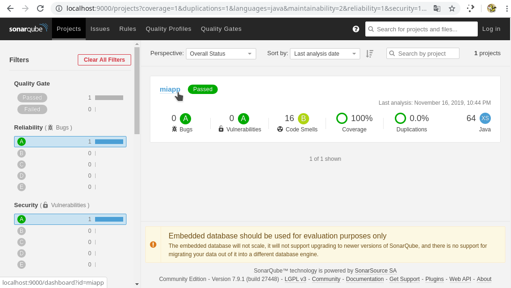
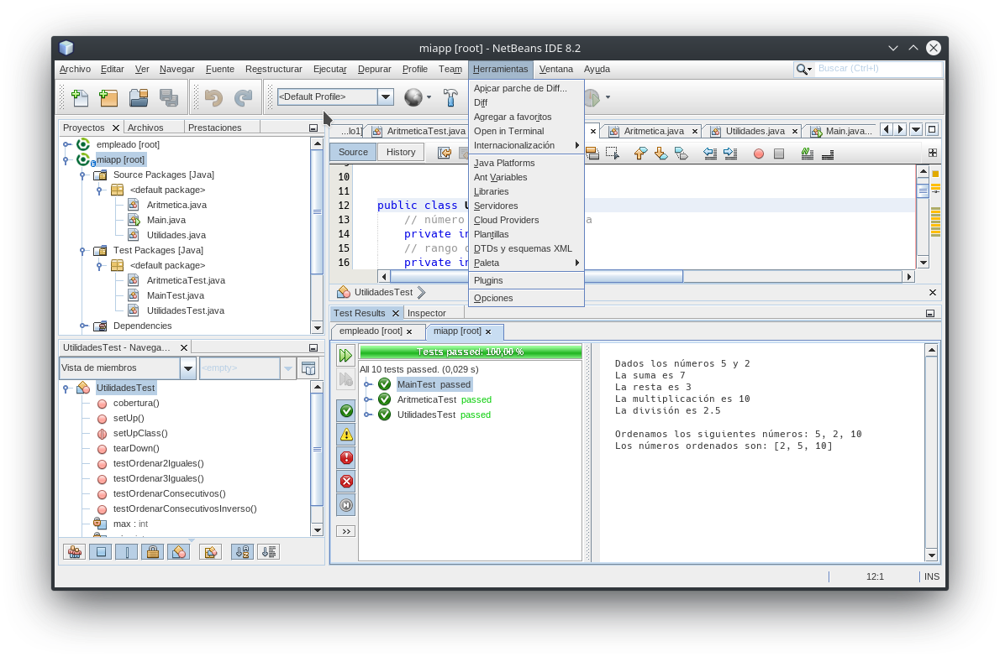
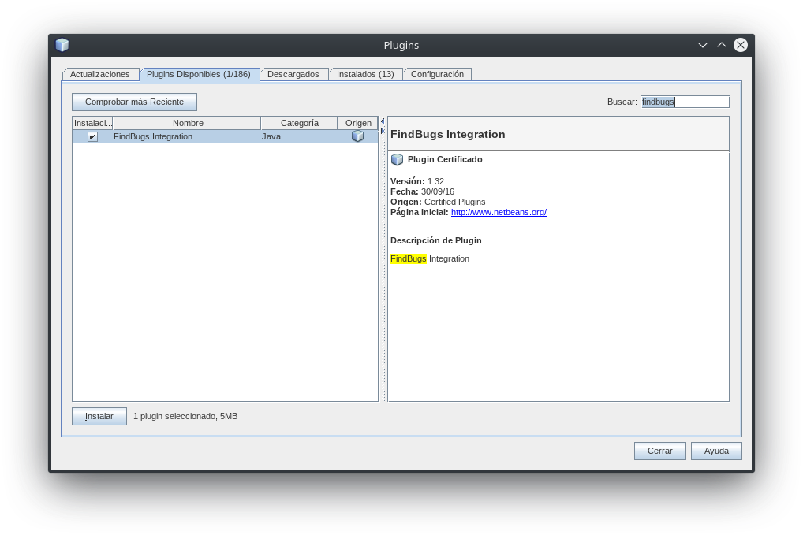
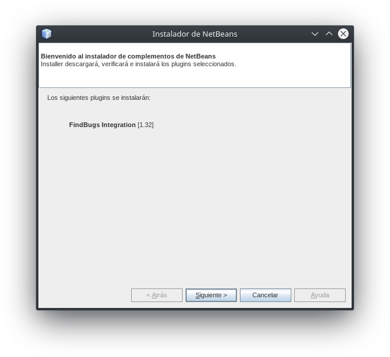
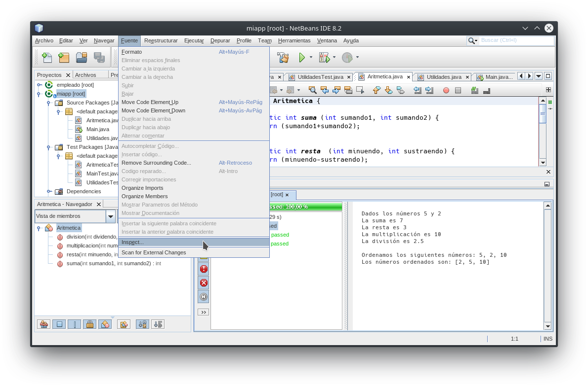
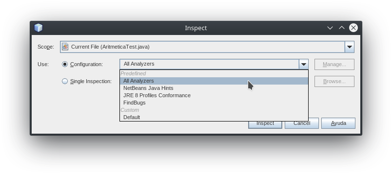
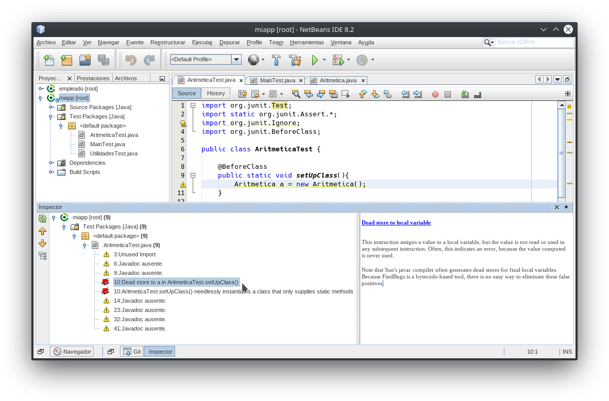
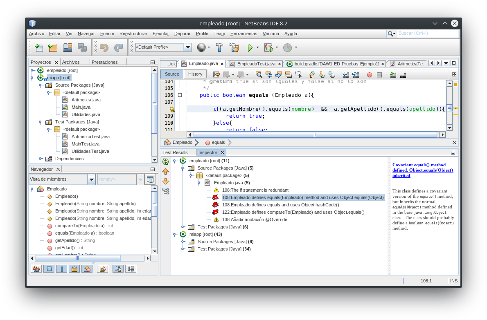

# DAW1-ED-Pruebas-Ejemplo1

[](https://sonarcloud.io)

[](https://travis-ci.org/jamj2000/DAW1-ED-Pruebas-Ejemplo1)
[](https://codecov.io/gh/jamj2000/DAW1-ED-Pruebas-Ejemplo1)
[](https://sonarcloud.io/organizations/jamj2000-github/projects)


[](https://github.com/jamj2000/DAW1-ED-Pruebas-Ejemplo1/issues) 
[](https://github.com/jamj2000/DAW1-ED-Pruebas-Ejemplo1/network)
[](https://github.com/jamj2000/DAW1-ED-Pruebas-Ejemplo1/stargazers)
[](https://github.com/jamj2000/DAW1-ED-Pruebas-Ejemplo1/blob/master/LICENSE)
[](http://hits.dwyl.com/jamj2000/DAW1-ED-Pruebas-Ejemplo1)


## Pruebas unitarias en **Java** con **JUnit4** (Gradle)

### Código a testear (pruebas de unidad)

El código de la aplicación lo componen 3 clases:

- Main  (Clase principal)
- Aritmética
- Utilidades

La clase Main es la que hace uso de los métodos definidos en Aritmética y Utilidades.

Dentro de **Aritmética** tenemos 4 métodos estáticos:
- `int suma            (int num1, int num2)`
- `int resta           (int num1, int num2)`
- `int multiplicacion  (int num1, int num2)`
- `double division     (int num1, int num2)`
 
Dentro de **Utilidades** tenemos 1 métodos estático:
- `int [] ordenar (int num1, int num2, int num3)`  (para ordenar un array de 3 enteros)


### Requisitos

Es necesario el uso del sistema de construcción (build) **gradle**. Si trabajamos con NetBeans deberemos instalar el plugin para gradle. 

Asimismo, en el archivo [build.gradle](build.gradle) añadiremos la línea *apply plugin: "jacoco"* (Java Code Coverage), para poder realizar cobertura de código.


### Clases de prueba

Las clases de prueba son:

- MainTest
- AritméticaTest
- UtilidadesTest


### Servicios web utilizados

Se utilizan 3 servicios web:

- [Travis-CI.org](https://travis-ci.org/jamj2000/DAW1-ED-Pruebas-Ejemplo1): para ***integración continua*** (construcción y paso de tests)
- [Codecov.io](https://codecov.io/gh/jamj2000/DAW1-ED-Pruebas-Ejemplo1): para ***cobertura de código***
- [Sonarcloud.io](https://sonarcloud.io/organizations/jamj2000-github/projects): para ***análisis de código***

Es importante tener un archivo **`.travis.yml`** adecuado. Aquí tienes el utilizado en este proyecto:

- [.travis.yml](.travis.yml)

### Análisis estático de código con SonarQube en Sonarcloud.io

Para realizar un análisis de la calidad del código (bugs, vulnerabilidades, *code smells* y demás) nos hemos registrado con nuestra cuenta de GitHub en https://sonarcloud.io, hemos generado un *token* y hemos añadido este proyecto. 

Al principio del archivo [**`build.gradle`**](build.gradle) debemos escribir las líneas:

```
plugins {
  id "org.sonarqube" version "2.6"
}
```
Para realizar el análisis, ejecutamos localmente la sentencia:

```
./gradlew sonarqube \
  -Dsonar.organization=jamj2000-github \
  -Dsonar.host.url=https://sonarcloud.io \
  -Dsonar.login=<token>
```
> NOTA: Debemos sustituir *\<token\>* por el generado previamente.




### Análisis estático de código con SonarQube en equipo local

Si no deseamos utilizar el servidor anterior, podemos lanzar nuestro propio servidor sonarqube local. Para ello haremos uso de un contenedor de Docker.

> NOTA: Es necesario tener instalado previamente el software para docker.
>   Puedes consultar como hacerlo en https://github.com/jamj2000/docker

Iniciamos el contenedor con el servidor sonarqube. 

```bash
docker  run  -d  -p 9000:9000  --name sonarqube  sonarqube:lts
```
Podemos ver si el servicio se ha iniciado correctamente con el comando:

```bash
docker  ps
```

> NOTA: Es posible que nos aparezca el siguiente mensaje:
>
>       SonarScanner will require Java 11+ to run starting in SonarQube 8.x
>
> Así que si disponemos de una versión de Java inferior a la 11, deberemos usar SonarQube versión inferior a 8.
> Por ejemplo para usar la version 7.1-alpine de SonarQube ejecutaremos:
>
>       docker  rm   -f  sonarqube    # eliminamos contenedor anterior
>       docker  run  -d  -p 9000:9000  --name sonarqube  sonarqube:7.1-alpine

El servicio será accesible a través del puerto 9000. Tardará unos minutitos en estar disponible.

Para eliminar construcciones previas, volver a construir, pasar tests y realizar análisis estático con sonarqube, ejecutamos desde la carpeta donde tenemos el archivo de construcción `build.gradle` el siguiente comando:

```bash
gradle  clean  sonarqube
```

Visitamos la URL `http://localhost:9000`. Puede tardar un tiempo en cargar.






Es aconsejable realizar `Log in`, puesto que así podremos realizar tareas de edición. Por defecto existe un usuario `admin`con contraseña `admin`. Son las credenciales que utilzaremos.

### Análisis estático de código con FindBugs en Netbeans

Una forma más sencilla de realizar análisis estático de código es utilizar el plugin **FindBugs** de Netbeans.

Deberemos primeramente instalar dicho plugin en el caso de no tenerlo ya instalado.

Para ello seguimos los siguientes pasos: **Herramientas -> Plugins**



En la pestaña **Plugins disponibles** buscamos *findbugs*



Si no lo tenemos instalado, nos aparecerá en la parte izquierda para instalarlo. Lo marcamos y pulsamos en instalar. Después seguimos el asistente.



Una vez instalado el plugin, ya podremos hacer uso de él para realizar **análisis estático de código**.

Para ello pulsamos en **Fuente -> Inspect**.



En **Scope** podemos escoger entre cuatro ámbitos, de más general a más específico:

- Open Projects
- Current Project
- Current Package
- Current File


En **Configuration** podemos escoger entre distintas opciones. Seleccionaremos **All Analyzers**.



A continuación se muestra Netbeans con la pestaña **Inspector** para la clase `AritmeticaTest`.



A continuación se muestra Netbeans con la pestaña **Inspector** para todos los proyectos abiertos.




