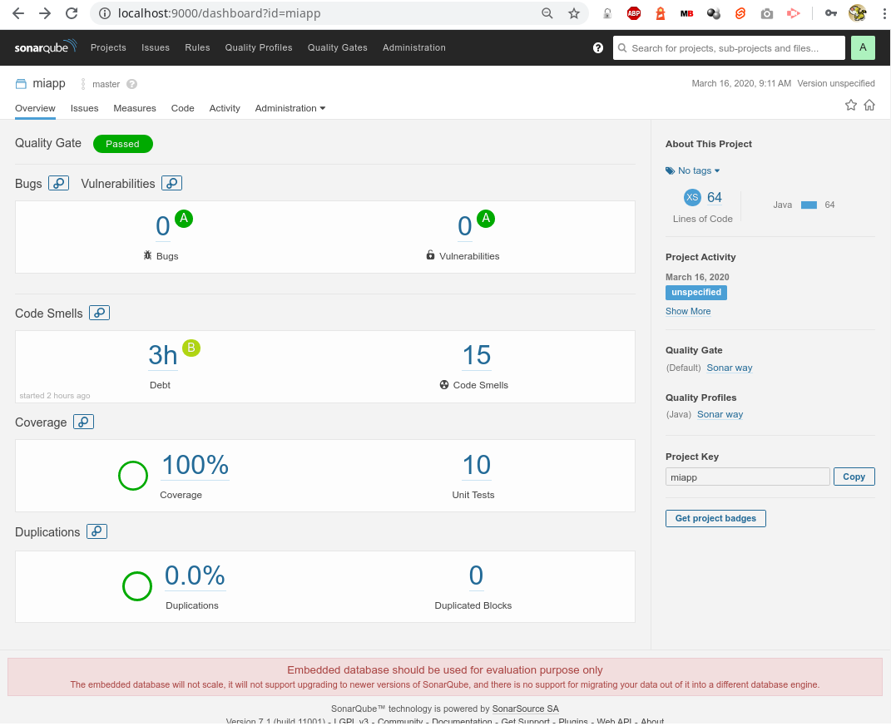
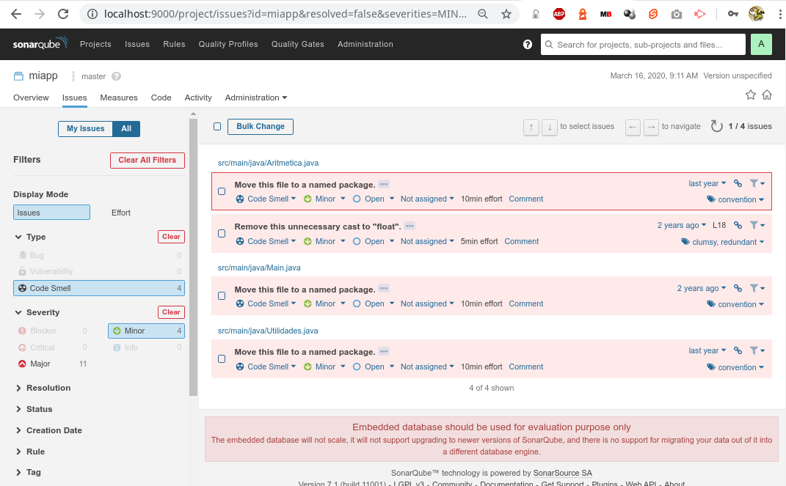
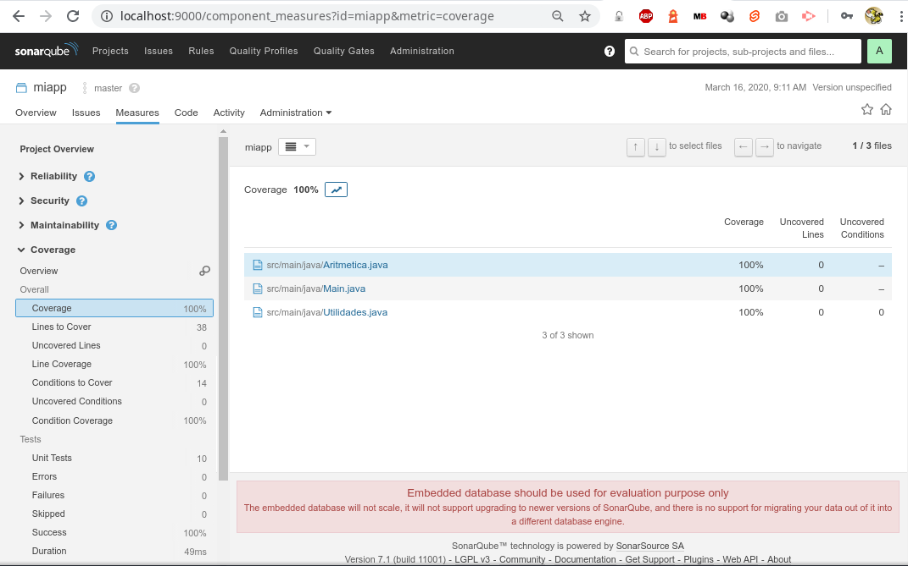
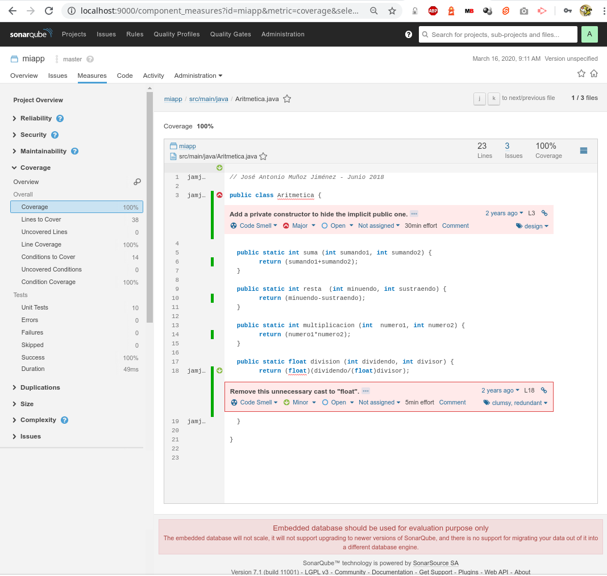
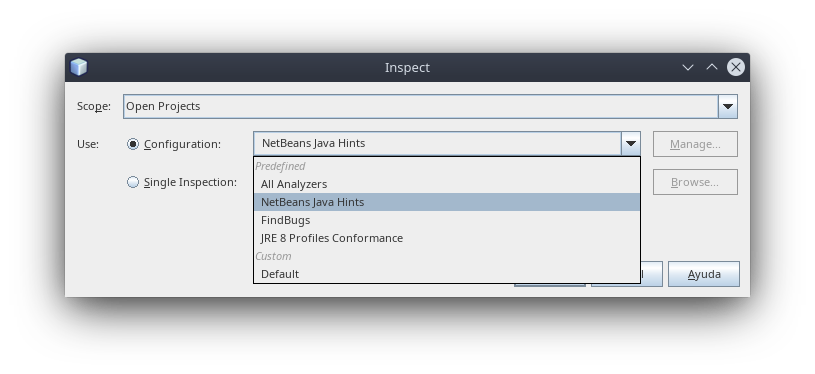
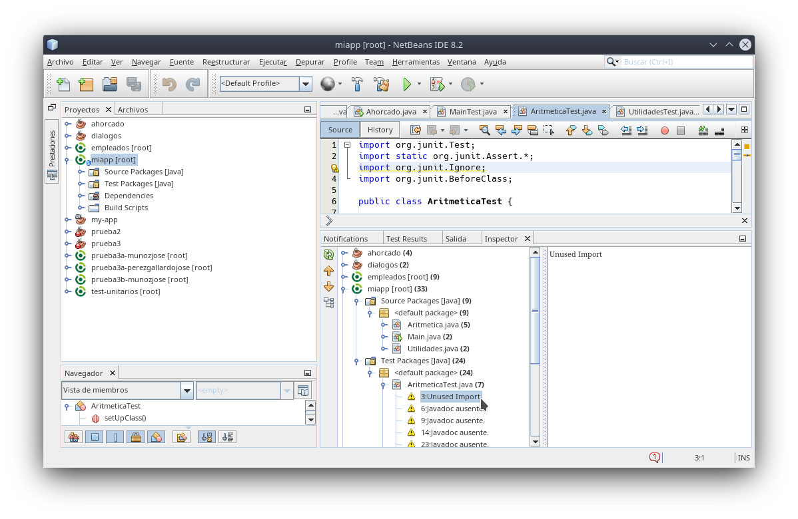

# Test-JUnit5-Aritmetica


[](https://github.com/jamj2000/DAW1-ED-Pruebas-Ejemplo1/issues) 
[](https://github.com/jamj2000/DAW1-ED-Pruebas-Ejemplo1/network)
[](https://github.com/jamj2000/DAW1-ED-Pruebas-Ejemplo1/stargazers)
[](https://github.com/jamj2000/DAW1-ED-Pruebas-Ejemplo1/blob/master/LICENSE)
[](http://hits.dwyl.com/jamj2000/DAW1-ED-Pruebas-Ejemplo1)


## Pruebas unitarias en **Java** con **JUnit5** (Gradle)

### Requisitos previos

Este proyecto se ha desarrollado en Netbeans con el sistema de construcción **Gradle**. Por tanto es necesario tener instalado el plugin para `Gradle` instalado en IntelliJ IDEA.


### Código a testear (pruebas de unidad)

El código de la aplicación lo componen 3 clases:

- [Main](src/main/java/aritmetica/Main.java)  (Clase principal)
- [Aritmética](src/main/java/aritmetica/Aritmetica.java)
- [Utilidades](src/main/java/aritmetica/Utilidades.java)

La clase Main es la que hace uso de los métodos definidos en Aritmética y Utilidades.

Dentro de **Aritmética** tenemos 4 métodos estáticos:
- `int suma            (int num1, int num2)`
- `int resta           (int num1, int num2)`
- `int multiplicacion  (int num1, int num2)`
- `double division     (int num1, int num2)`
 
Dentro de **Utilidades** tenemos 1 métodos estático:
- `int [] ordenar (int num1, int num2, int num3)`  (para ordenar un array de 3 enteros)


### Clases de prueba

Las clases de prueba son:

- [MainTest](src/test/java/aritmetica/MainTest.java)
- [AritméticaTest](src/test/java/aritmetica/AritmeticaTest.java)
- [UtilidadesTest](src/test/java/aritmetica/UtilidadesTest.java)

Se ha comprobado también el constructor por defecto de cada clase, con la finalidad de que el informe de cobertura fuera del 100%.


### Ejecución de pruebas

Para ejecutar las pruebas sobre el código, ejecutaremos en el terminal de texto:

```
gradle  test
```

### Informe de cobertura

Para generar el informe de cobertura ejecutamos en el terminal de texto:

```
gradle  jacocoTestReport
```

Este comando debe ejecutarse desde la misma carpeta en la cuál tenemos el archivo `build.gradle`.

Para ver el informe de cobertura generado en formato HTML, ejecutamos desde el terminal de texto:

```
firefox   build/jacocoHtml/index.html
```


## Integración continua

Para integración continua (***construcción y paso de tests***) se hara uso de **[travis-CI.org](https://travis-ci.org/jamj2000/DAW1-ED-Pruebas-Ejemplo1)** 

Es importante tener un archivo **`.travis.yml`** adecuado. Aquí tienes el utilizado en este proyecto:

- [.travis.yml](.travis.yml)

En este archivo indicamos la plataforma necesaria para nuestra aplicación y los comandos necesarios para lanzar los tests. 

**Ejemplo simplificado**

```yaml
language: java
jdk:
  - openjdk8
script:
  - gradle  test  run
```


**Ejemplo de integración con travis-ci.org**


## Análisis estático de código

Tenemos varias formas de realizar análisis estático de código:

- SonarQube en equipo local
- SonarQube en SonarCloud.io
- Intellij mediante Code/Inspect Code...
- NetBeans mediante Fuente/Inspect
- NetBeans mediante plugin FindBugs (está obsoleto)

Es preferible usar la primera forma.

### Análisis estático de código con SonarQube en equipo local

Para realizar un análisis de la calidad del código (bugs, vulnerabilidades, *code smells* y demás) recomiendo usar **SonarQube** en el equipo local. Podemos lanzar nuestro propio servidor sonarqube local. Para ello haremos uso de un contenedor de **Docker**.

> NOTA: Es necesario tener instalado previamente el software para docker.
>   Puedes consultar como hacerlo en https://github.com/jamj2000/docker

Iniciamos el contenedor con el servidor sonarqube. 

```bash
docker  run  -d  -p 9000:9000  --name sonarqube  sonarqube:community
```
Podemos ver si el servicio se ha iniciado correctamente con el comando:

```bash
docker  ps
```


El servicio será accesible a través del puerto 9000. Tardará unos minutitos en estar disponible.

Para eliminar construcciones previas, volver a construir, pasar tests y realizar análisis estático con sonarqube, ejecutamos desde la carpeta donde tenemos el archivo de construcción `build.gradle` el siguiente comando:

```bash
gradle  clean  sonarqube
```

Visitamos la URL `http://localhost:9000`. Puede tardar un tiempo en cargar.


Es aconsejable realizar `Log in`, puesto que así podremos realizar tareas de edición. 

Por defecto existe un usuario **`admin`** con contraseña **`admin`**. Son las credenciales que utilzaremos. En la ventana emergente que aparece pulsar en `Skip this tutorial`.

Ahora, si pulsamos sobre el nombre de la aplicación, podremos ver un resumen.



Ahora mismo, los apartados que tienen especial interés para nosotros son los de **`Code Smells`** y **`Coverage`**. El primero nos indica las prácticas de codificación que no se ajustan del todo a las recomendaciones y el segundo nos muestra la cobertura de código conseguida con los tests diseñados.



Hay 2 tipos de `code smell`. Los *`major`* y los *`minor`*, siendo los primeros los que pueden tener más relevancia.

En el apartado de `coverage` podemos comprobar el % de cobertura de nuestros tests.



También es posible examinar archivo por archivo. La línea verde que aparece a la izquierda es la cobertura realizada.

Aquí también podemos gestionar nuestros `code smells`. 




### Usando SonarQube en Sonarcloud.io

- [Sonarcloud.io](https://sonarcloud.io/organizations/jamj2000-github/projects)

Nos hemos registrado con nuestra cuenta de GitHub en https://sonarcloud.io, hemos generado un *token* y hemos añadido este proyecto. 

Al principio del archivo [**`build.gradle`**](build.gradle) debemos escribir las líneas:

```
plugins {  
  id 'org.sonarqube' version '2.6'
  // ...
}
```
Para realizar el análisis, ejecutamos localmente la sentencia:

```
./gradlew sonarqube \
  -Dsonar.organization=jamj2000-github \
  -Dsonar.host.url=https://sonarcloud.io \
  -Dsonar.login=<token>
```
> NOTA: Debemos sustituir *\<token\>* por el generado previamente.


### Análisis estático de código en IntelliJ IDEA


### Análisis estático de código en Netbeans

Otra forma, mucho más limitada, de realizar *análisis estático de código* desde Netbeans es ir al menú a **`Fuente`** -> **`Inspect`**.


En **`Configuration`** seleccionamos `Netbeans Java Hits`.

Y luego pulsamos en el botón `Inspect`.



Se realizará una inspección muy básica de todos los proyectos que tenemos abiertos. Seleccionando nuestro proyecto, podemos inspeccionar los distintos archivos, tanto los que están en el *paquete de fuentes* como los que están en *paquete de tests*.

Por ejemplo, a continuación se muestra la clase `AritmeticaTest.java` donde se muestra que hay una sentencia `import` que no se usa. La mayoría de los avisos se refieren a la falta de documentación de Java (javadoc).



Cómo puedes ver es una herramienta bastante limitada. Por tanto, lo más aconsejable es usar **Sonarqube** para este fin, que es una herramienta mucho más potente.


### Análisis estático de código con FindBugs en Netbeans

**ATENCIÓN: FindBugs es un proyecto que, al parecer, está más muerto que vivo. El plugin para Netbeans 8.2 no está disponible.**

**El texto que se muestra a continuación será eliminado en un futuro próximo. Disponible aún con fines históricos.**  


Una forma más sencilla de realizar análisis estático de código es utilizar el plugin **FindBugs** de Netbeans.

Deberemos primeramente instalar dicho plugin en el caso de no tenerlo ya instalado.

Para ello seguimos los siguientes pasos: **Herramientas -> Plugins**


En la pestaña **Plugins disponibles** buscamos *findbugs*


Si no lo tenemos instalado, nos aparecerá en la parte izquierda para instalarlo. Lo marcamos y pulsamos en instalar. Después seguimos el asistente.


Una vez instalado el plugin, ya podremos hacer uso de él para realizar **análisis estático de código**.

Para ello pulsamos en **Fuente -> Inspect**.


En **Scope** podemos escoger entre cuatro ámbitos, de más general a más específico:

- Open Projects
- Current Project
- Current Package
- Current File


En **Configuration** podemos escoger entre distintas opciones. Seleccionaremos **All Analyzers**.


A continuación se muestra Netbeans con la pestaña **Inspector** para la clase `AritmeticaTest`.


A continuación se muestra Netbeans con la pestaña **Inspector** para todos los proyectos abiertos.


