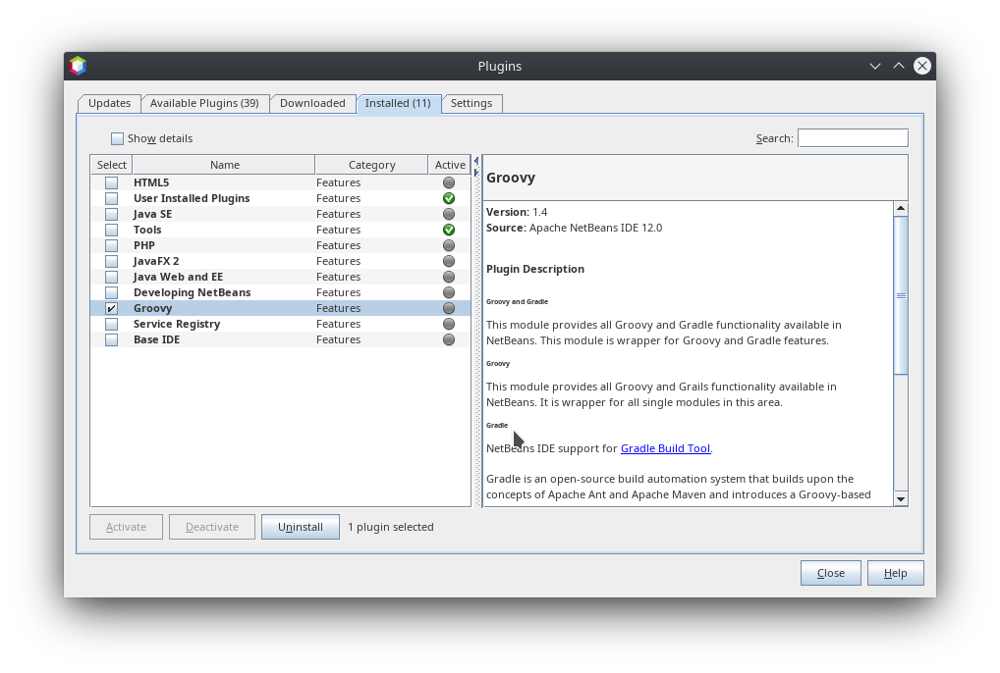
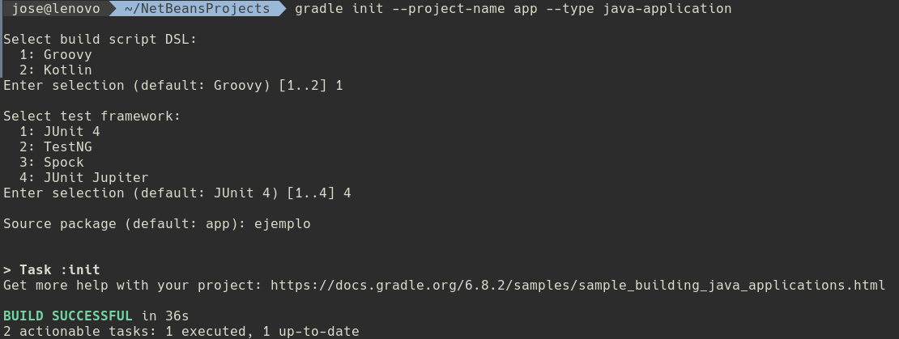

# DAW1-ED-Pruebas-Ejemplo1

[](https://travis-ci.org/jamj2000/DAW1-ED-Pruebas-Ejemplo1)


[](https://github.com/jamj2000/DAW1-ED-Pruebas-Ejemplo1/issues) 
[](https://github.com/jamj2000/DAW1-ED-Pruebas-Ejemplo1/network)
[](https://github.com/jamj2000/DAW1-ED-Pruebas-Ejemplo1/stargazers)
[](https://github.com/jamj2000/DAW1-ED-Pruebas-Ejemplo1/blob/master/LICENSE)
[](http://hits.dwyl.com/jamj2000/DAW1-ED-Pruebas-Ejemplo1)


## Pruebas unitarias en **Java** con **JUnit5** (Gradle)

### Requisitos previos

Este proyecto se ha desarrollado con el sistema de construcción **Gradle**. Si trabajamos con algún IDE como Netbeans, es necesario tener instalado el plugin para `Gradle`. En Netbeans 12.0 LTS ya está instalado.



Puede descargarse Netbeans 12.0 LTS desde:

- https://netbeans.apache.org/download/nb120/nb120.html


Aunque este proyecto se puede trabajar y testear desde un IDE como Netbeans, en este documento no se explica este caso, sino la forma de realizar todo el proceso desde un terminal de texto. 

En Linux, podemos instalar la última versión de Gradle haciendo uso de SDKMAN. Para instalar SDKMAN:

```bash
curl -s "https://get.sdkman.io" | bash
```

Después, para instalar `gradle`:

```bash
sdk install gradle
source "/home/usuario/.sdkman/bin/sdkman-init.sh"
```

La versión de gradle usada ha sido la versión 6.8.2

### Inicio de proyecto

Vamos a generar un nuevo proyecto con nombre `app` y paquete `ejemplo` que para contener las clases. Además los tests se realizaran con JUnit Jupiter (JUnit 5).

gradle init  --project-name app  --type java-application

Seleccionamos:
```
<1>       Groovy
<4>       JUnit Jupiter
<package> ejemplo
```



La estructura de archivos generada es la siguiente:


Las clases que vienen por defecto no nos interesan, por tanto, las eliminaremos:

```bash
rm  src/main/java/ejemplo/*.java
rm  src/test/java/ejemplo/*.java
```

### Configuración personalizada

Haremos uso del siguiente archivo [`build.gradle`](build.gradle):

```groovy
plugins {
  id 'java'
  id 'application'
  id 'jacoco'
  id 'org.barfuin.gradle.jacocolog' version '1.2.4' // para mostrar cobertura en el terminal
  id 'org.sonarqube' version '2.6'
}

mainClassName = 'ejemplo.Main'

repositories {
    jcenter()
    //mavenCentral()
}

dependencies {
    testImplementation(platform('org.junit:junit-bom:5.7.1'))
    testImplementation('org.junit.jupiter:junit-jupiter')
}

jar {
    manifest {
       attributes ('Main-Class': "${mainClassName}")
    }
}

test {
    useJUnitPlatform()
    testLogging {
        events "passed", "skipped", "failed", "standardOut", "standardError"
  }
//  finalizedBy jacocoTestReport // se genera informe después de ejecutar los tests
}

jacocoTestReport {
    dependsOn test 
    reports {
        html.destination file("${buildDir}/jacocoHtml")
    }
}
```

La cobertura de código la obtenemos con el plugin `jacoco`.

El análisis estático de código lo obtenemos con el plugin `org.sonarqube`.

A continuación pasamos a ver el código de nuestra aplicación y los tests realizados.


### Código a testear (pruebas de unidad)

El código de la aplicación lo componen 3 clases:

- [Main](src/main/java/ejemplo/Main.java)  (Clase principal)
- [Aritmética](src/main/java/ejemplo/Aritmetica.java)
- [Utilidades](src/main/java/ejemplo/Utilidades.java)

La clase Main es la que hace uso de los métodos definidos en Aritmética y Utilidades.

Dentro de **Aritmética** tenemos 4 métodos estáticos:
- `int suma            (int num1, int num2)`
- `int resta           (int num1, int num2)`
- `int multiplicacion  (int num1, int num2)`
- `double division     (int num1, int num2)`
 
Dentro de **Utilidades** tenemos 1 métodos estático:
- `int [] ordenar (int num1, int num2, int num3)`  (para ordenar un array de 3 enteros)


### Clases de prueba

Las clases de prueba son:

- [MainTest](src/test/java/ejemplo/MainTest.java)
- [AritméticaTest](src/test/java/ejemplo/AritmeticaTest.java)
- [UtilidadesTest](src/test/java/ejemplo/UtilidadesTest.java)

Se ha comprobado también el constructor por defecto de cada clase, con la finalidad de que el informe de cobertura fuera del 100%.


### Ejecución de pruebas

Para ejecutar las pruebas sobre el código, ejecutaremos en el terminal de texto:

Para ver la cobertura de código conseguida con las pruebas (tests), ejecutaremos:

```bash
gradle  clean  test
```

### Informe de cobertura

Para generar el informe de cobertura ejecutamos en el terminal de texto:

```
gradle  jacocoTestReport
```

Este comando debe ejecutarse desde la misma carpeta en la cuál tenemos el archivo `build.gradle`.

Para ver el informe de cobertura generado en formato HTML, ejecutamos desde el terminal de texto:

```
firefox   build/jacocoHtml/index.html
```


## Integración continua

Para integración continua (***construcción y paso de tests***) se hara uso de **[travis-CI.org](https://travis-ci.org/jamj2000/DAW1-ED-Pruebas-Ejemplo1)** 

Es importante tener un archivo **`.travis.yml`** adecuado. Aquí tienes el utilizado en este proyecto:

- [.travis.yml](.travis.yml)

En este archivo indicamos la plataforma necesaria para nuestra aplicación y los comandos necesarios para lanzar los tests. 

**Ejemplo simplificado**

```yaml
language: java
jdk:
  - openjdk11
script:
  - gradle jacocoTestReport
```


**Ejemplo de integración con travis-ci.org**


## Análisis estático de código

Tenemos varias formas de realizar análisis estático de código:

- SonarQube en equipo local
- SonarQube en SonarCloud.io

Es preferible usar la primera forma.

### Análisis estático de código con SonarQube en equipo local

Para realizar un análisis de la calidad del código (bugs, vulnerabilidades, *code smells* y demás) recomiendo usar **SonarQube** en el equipo local. Podemos lanzar nuestro propio servidor sonarqube local. Para ello haremos uso de un contenedor de **Docker**.

> NOTA: Es necesario tener instalado previamente el software para docker.
>   Puedes consultar como hacerlo en https://github.com/jamj2000/docker

Iniciamos el contenedor con el servidor sonarqube. 

```bash
docker  run  -d  -p 9000:9000  --name sonarqube  sonarqube:lts
```
Podemos ver si el servicio se ha iniciado correctamente con el comando:

```bash
docker  ps
```

> NOTA: Es posible que nos aparezca el siguiente mensaje:
>
>       SonarScanner will require Java 11+ to run starting in SonarQube 8.x
>
> Así que si disponemos de una versión de Java inferior a la 11, deberemos usar SonarQube versión inferior a 8.
> Por ejemplo para usar la version 7.1-alpine de SonarQube ejecutaremos:
>
>       docker  rm   -f  sonarqube    # eliminamos contenedor anterior
>       docker  run  -d  -p 9000:9000  --name sonarqube  sonarqube:7.1-alpine

El servicio será accesible a través del puerto 9000. Tardará unos minutitos en estar disponible.

Para eliminar construcciones previas, volver a construir, pasar tests y realizar análisis estático con sonarqube, ejecutamos desde la carpeta donde tenemos el archivo de construcción `build.gradle` el siguiente comando:

```bash
gradle  clean  sonarqube
```

Visitamos la URL `http://localhost:9000`. Puede tardar un tiempo en cargar.


Es aconsejable realizar `Log in`, puesto que así podremos realizar tareas de edición. 

Por defecto existe un usuario **`admin`** con contraseña **`admin`**. Son las credenciales que utilzaremos. En la ventana emergente que aparece pulsar en `Skip this tutorial`.

Ahora, si pulsamos sobre el nombre de la aplicación, podremos ver un resumen.


Ahora mismo, los apartados que tienen especial interés para nosotros son los de **`Code Smells`** y **`Coverage`**. El primero nos indica las prácticas de codificación que no se ajustan del todo a las recomendaciones y el segundo nos muestra la cobertura de código conseguida con los tests diseñados.


Hay 2 tipos de `code smell`. Los *`major`* y los *`minor`*, siendo los primeros los que pueden tener más relevancia.

En el apartado de `coverage` podemos comprobar el % de cobertura de nuestros tests.


También es posible examinar archivo por archivo. La línea verde que aparece a la izquierda es la cobertura realizada.

Aquí también podemos gestionar nuestros `code smells`. 


### Usando SonarQube en Sonarcloud.io

- [Sonarcloud.io](https://sonarcloud.io/organizations/jamj2000-github/projects)

Nos hemos registrado con nuestra cuenta de GitHub en https://sonarcloud.io, hemos generado un *token* y hemos añadido este proyecto. 

Al principio del archivo [**`build.gradle`**](build.gradle) debemos escribir las líneas:

```
plugins {  
  id 'org.sonarqube' version '2.6'
  // ...
}
```
Para realizar el análisis, ejecutamos localmente la sentencia:

```
./gradlew sonarqube \
  -Dsonar.organization=jamj2000-github \
  -Dsonar.host.url=https://sonarcloud.io \
  -Dsonar.login=<token>
```
> NOTA: Debemos sustituir *\<token\>* por el generado previamente.


